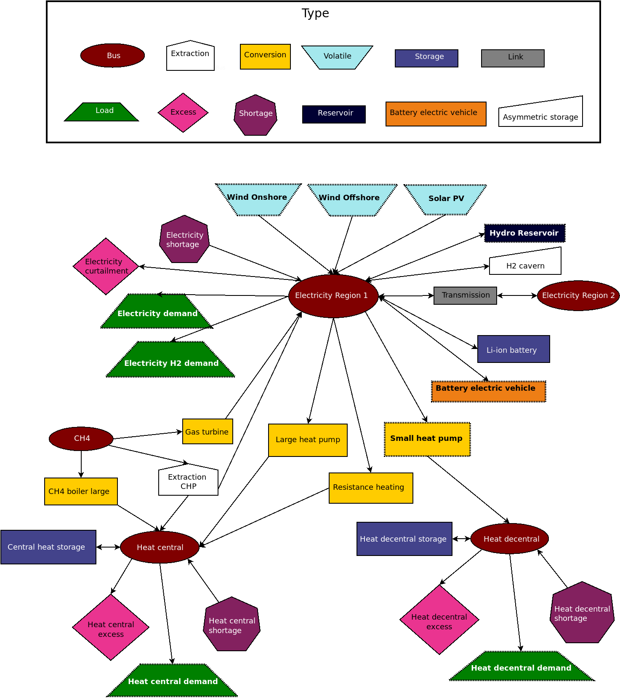

# Analysis of the results from oemof-flexmex

This is a set of scripts written to analyse the results obtained from running the energy
system model [oemof-flexmex](https://github.com/modex-flexmex/oemof-flexmex). 
It mainly consists of functions for plotting data from the oemof.tabular format.

I am working on this directory as part of a university thesis and primarily made it for
myself. 

##Model structure
